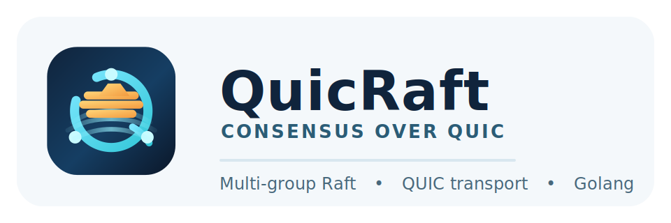

[](https://go.dev/)
[](LICENSE)
[](VERSION)

A multi-group Raft consensus library for Go with QUIC transport and at-rest encryption.

QuicRaft implements the [Raft consensus algorithm](https://raft.github.io/) with full spec compliance against both the [extended Raft paper](docs/references/raft.pdf) and the [Ongaro PhD thesis](docs/references/OngaroPhD.pdf). The implementation is verified by 5,400+ tests across 27 packages, all above 91% coverage, including a Porcupine-based linearizability test suite.

## Features

- **Multi-group Raft** -- Thousands of independent Raft groups per process with a sharded ReadyMap (64 buckets) for O(1) shard dispatch
- **Minimal dependencies** -- No external or embedded database dependencies for Raft log storage
- **QUIC transport** -- Built on [quic-go](https://github.com/quic-go/quic-go) with mTLS, multiplexed streams, and 0-RTT reconnection
- **Custom binary wire format** -- Fixed-layout little-endian encoding with zero-copy semantics; no protobuf dependency
- **At-rest encryption** -- Authenticated encryption (AES-GCM or ChaCha20-Poly1305) with automatic hardware detection, barrier/seal/unseal pattern, epoch-based key rotation, and FIPS 140 build support
- **Sharded WAL** -- 16-shard write-ahead log for parallel persistence with fdatasync durability
- **Full Raft spec** -- Leader election, log replication, membership changes, snapshots, ReadIndex, LeaseRead, PreVote, leadership transfer, CheckQuorum
- **Client sessions** -- At-most-once delivery with deterministic expiry and deduplication across replicas (PhD Figure 6.1)
- **Three state machine types** -- `StateMachine`, `ConcurrentStateMachine`, and `DiskStateMachine` interfaces for different workload profiles
- **Cluster discovery** -- Static, multicast, and DNS SRV discovery with automated bootstrap orchestration
- **Observability** -- Prometheus metrics for proposals, commits, elections, snapshots, transport, and WAL operations
- **Lock-free hot paths** -- Atomics and lock-free algorithms over mutexes on performance-critical paths
- **Batch proposal/read coalescing** -- ReadIndex requests are batched to amortize heartbeat quorum rounds
- **Encrypted snapshot transfer** -- Snapshots decrypted before transport (per-node barriers), QUIC provides in-transit encryption

## Quick Start

### Starting a single-node cluster with a KV state machine

```go
package main

import (
    "context"
    "fmt"
    "log"
    "time"

    quicraft "github.com/jeremyhahn/go-quicraft/pkg"
    "github.com/jeremyhahn/go-quicraft/pkg/config"
    "github.com/jeremyhahn/go-quicraft/pkg/sm/kv"
)

func main() {
    // Channel notified when a leader is elected
    leaderCh := make(chan struct{}, 1)

    hostCfg := config.HostConfig{
        WALDir:        "/var/data/quicraft/wal",
        NodeHostDir:   "/var/data/quicraft",
        RaftAddress:   "localhost:63100",
        ListenAddress: "0.0.0.0:63100",
        DeploymentID:  1,
        EventListener: &config.EventListener{
            OnLeaderUpdated: func(info config.LeaderInfo) {
                select {
                case leaderCh <- struct{}{}:
                default:
                }
            },
        },
    }

    host, err := quicraft.NewHost(hostCfg, quicraft.WithoutTransport())
    if err != nil {
        log.Fatal(err)
    }
    defer host.Close()

    // Single-node cluster
    members := map[uint64]string{
        1: "localhost:63100",
    }

    shardCfg := config.Config{
        ShardID:   1,
        ReplicaID: 1,
    }
    if err := host.StartShard(members, false, kv.NewMemoryCreateFunc(), shardCfg); err != nil {
        log.Fatal(err)
    }

    // Wait for leader election via EventListener callback
    <-leaderCh

    // Write a key
    ctx, cancel := context.WithTimeout(context.Background(), 5*time.Second)
    defer cancel()

    cmd, _ := kv.EncodePut([]byte("hello"), []byte("world"))
    if _, err := host.SyncPropose(ctx, 1, cmd); err != nil {
        log.Fatal(err)
    }

    // Linearizable read
    val, err := host.SyncRead(ctx, 1, []byte("hello"))
    if err != nil {
        log.Fatal(err)
    }
    fmt.Printf("hello = %s\n", val.([]byte)) // hello = world
}
```

### Write modes

QuicRaft supports three write durability modes. Pick the one that matches your latency and durability requirements.

**Sync** -- strongest durability. Blocks until the entry is replicated to a quorum and applied to the state machine. This is the default and the right choice when you need read-after-write consistency.

```go
// Sync write -- blocks until quorum commit + SM apply (~10-30ms)
result, err := host.SyncPropose(ctx, shardID, cmd)

// Async variant -- returns immediately, result arrives on channel
rs, err := host.Propose(ctx, shardID, cmd)
if err != nil {
    return err
}
defer rs.Release()

select {
case result := <-rs.ResultC():
    if result.Err != nil {
        return result.Err
    }
    fmt.Println("applied at index:", result.Value)
case <-ctx.Done():
    return ctx.Err()
}
```

**WAL-durable** -- lower latency. Returns after the entry is persisted to the local WAL (~1-2ms) but before quorum replication. If the leader crashes before replicating, the entry can be lost. Enable `NotifyCommit` on the host to use this mode.

```go
hostCfg := config.HostConfig{
    // ...
    NotifyCommit: true, // Enable early WAL-durable notifications
}

rs, err := host.Propose(ctx, shardID, cmd)
if err != nil {
    return err
}
defer rs.Release()

select {
case <-rs.CommittedC():
    // Entry is durable in local WAL (~1-2ms). Quorum replication
    // is still in progress -- safe to acknowledge the client if
    // you can tolerate loss on leader crash.
case result := <-rs.ApplyResultC():
    // Full quorum commit + SM apply (~10-30ms). Use this channel
    // when you need the applied result or read-after-write safety.
case <-ctx.Done():
    return ctx.Err()
}
```

**Batched** -- amortized cost. Groups many writes into a single Raft entry, giving the same durability as Sync but at a fraction of the per-operation cost (~0.1-0.3ms per op). Good for high-throughput ingest where individual write latency is less important than aggregate throughput.

```go
import "github.com/jeremyhahn/go-quicraft/pkg/batch"

agg, err := batch.NewAggregator(host, batch.WithConfig(batch.Config{
    MaxBatchSize:  256,               // Flush after 256 ops
    FlushInterval: 5 * time.Millisecond, // Or after 5ms, whichever comes first
    QueueSize:     4096,              // Backpressure at 4096 pending ops
}))
if err != nil {
    log.Fatal(err)
}
defer agg.Close()

// Submit blocks until the batch containing this op is committed.
// Many concurrent Submit calls are grouped into one Raft proposal.
err = agg.Submit(ctx, shardID, cmd)
```

### Read consistency levels

Four read modes, from strongest to fastest:

| Mode | Consistency | Latency | Method |
|------|-------------|---------|--------|
| ReadIndex | Linearizable | ~5-15ms (heartbeat RTT) | `SyncRead` |
| LeaseRead | Linearizable | ~0.5-2ms (no RTT when lease valid) | `SyncRead` with `LeaseRead: true` |
| Stale | Eventual | ~0.01ms (local SM query) | `StaleRead` |
| Local | None (bypass Raft) | ~0.01ms | `QueryLocalNode` |

```go
// ReadIndex -- linearizable. Confirms leadership via heartbeat quorum,
// then queries the state machine. Default mode.
val, err := host.SyncRead(ctx, shardID, []byte("mykey"))

// LeaseRead -- linearizable, lower latency. When the leader has received
// heartbeat acks from a quorum within the lease window (ElectionRTT - 2
// ticks), it skips the heartbeat round-trip entirely. Falls back to
// ReadIndex when the lease has expired. Based on Ongaro PhD thesis 6.4.
// Enable per-shard:
shardCfg := config.Config{
    ShardID:   1,
    ReplicaID: 1,
    LeaseRead: true, // Requires CheckQuorum (enabled by default)
}
// SyncRead is the same call -- LeaseRead is transparent to the caller.
val, err = host.SyncRead(ctx, shardID, []byte("mykey"))

// Stale read -- reads from the local state machine without any consensus
// round-trip. Fast but may return stale data if this node is behind.
val, err = host.StaleRead(ctx, shardID, []byte("mykey"))

// QueryLocalNode -- direct SM.Lookup bypass. No Raft involvement at all.
// Only use when you know exactly what you're doing.
val, err = host.QueryLocalNode(ctx, shardID, []byte("mykey"))
```

**Zero-copy reads** -- for hot paths where interface boxing allocation matters, use the `Buf` variants. These return a `[]byte` directly (via the `NALookup` interface) and a release function for the underlying buffer:

```go
val, release, err := host.SyncReadBuf(ctx, shardID, []byte("mykey"))
if err != nil {
    return err
}
defer release()
// Use val before release() returns the buffer to the pool.
process(val)
```

### Session-managed writes

Sessions provide at-most-once delivery for non-idempotent operations. The session manager deduplicates retransmissions using a (clientID, seriesID) pair tracked through Raft consensus.

```go
// Register a session through Raft (all replicas agree on the session state)
session, err := host.GetNewSession(ctx, shardID)
if err != nil {
    return err
}
defer host.CloseSession(ctx, shardID, session)

// Propose with the session -- retries are automatically deduplicated
rs, err := host.ProposeWithSession(ctx, session, cmd)
if err != nil {
    return err
}
defer rs.Release()

result := <-rs.ResultC()
if result.Err != nil {
    return result.Err
}

// Advance the session's series ID after each successful proposal
session.ProposalCompleted()

// For idempotent operations, skip sessions entirely:
noopSession := host.GetNoOPSession(shardID)
host.SyncPropose(ctx, shardID, cmd) // No deduplication
```

### Three-node cluster with mTLS

```go
members := map[uint64]string{
    1: "node1:63100",
    2: "node2:63100",
    3: "node3:63100",
}

// Load mTLS certificates (required for multi-node clusters)
caCert, _ := os.ReadFile("/etc/quicraft/ca.pem")
cert, _ := os.ReadFile("/etc/quicraft/node1.pem")
key, _ := os.ReadFile("/etc/quicraft/node1-key.pem")

// Each node creates a Host with its own address and starts the shard
// with the same members map but its own ReplicaID.
hostCfg := config.HostConfig{
    WALDir:        "/var/data/quicraft/wal",
    NodeHostDir:   "/var/data/quicraft",
    RaftAddress:   "node1:63100",
    ListenAddress: "0.0.0.0:63100",
    DeploymentID:  1,
    TransportConfig: config.TransportConfig{
        MTLSConfig: &config.MTLSConfig{
            CACert: caCert,
            Cert:   cert,
            Key:    key,
        },
    },
}

shardCfg := config.Config{
    ShardID:   1,
    ReplicaID: 1, // 2 on node2, 3 on node3
}

host, _ := quicraft.NewHost(hostCfg)
host.StartShard(members, false, kv.NewMemoryCreateFunc(), shardCfg)
```

### Cluster discovery and bootstrap

Instead of hardcoding a members map, use the discovery and bootstrap packages to form a cluster automatically. Three discovery methods are available: static, multicast (LAN), and DNS SRV.

**Multicast discovery** -- zero-config LAN bootstrap. Nodes announce themselves on a multicast group and discover peers automatically. An HMAC-SHA256 shared secret prevents unauthorized nodes from joining.

```go
import (
    "context"
    "log"
    "time"

    quicraft "github.com/jeremyhahn/go-quicraft/pkg"
    "github.com/jeremyhahn/go-quicraft/pkg/bootstrap"
    "github.com/jeremyhahn/go-quicraft/pkg/config"
    "github.com/jeremyhahn/go-quicraft/pkg/discovery"
    "github.com/jeremyhahn/go-quicraft/pkg/sm/kv"
)

func main() {
    hostCfg := config.HostConfig{
        WALDir:        "/var/data/quicraft/wal",
        NodeHostDir:   "/var/data/quicraft",
        RaftAddress:   "host1:63100",
        ListenAddress: "0.0.0.0:63100",
        DeploymentID:  1,
    }

    host, err := quicraft.NewHost(hostCfg)
    if err != nil {
        log.Fatal(err)
    }
    defer host.Close()

    // Multicast discovery -- peers find each other on the LAN
    disc, err := discovery.NewMulticastDiscovery(discovery.MulticastConfig{
        NodeID:           1,
        Address:          "host1:63100",
        DeploymentID:     1,                          // Must match all nodes
        SharedSecret:     []byte("my-cluster-secret"), // HMAC-SHA256 authentication
        AnnounceInterval: 500 * time.Millisecond,
        DiscoverTimeout:  5 * time.Second,
        MinPeers:         2,                          // Wait for at least 2 other nodes
    })
    if err != nil {
        log.Fatal(err)
    }
    defer disc.Stop()

    // Bootstrap: discover peers, check quorum, build member map, start shard
    bs := bootstrap.NewBootstrapper(bootstrap.Config{
        NodeID:    1,
        Address:   "host1:63100",
        ShardID:   1,
        ReplicaID: 1,
        Discovery: disc,
        CreateFn:  kv.NewMemoryCreateFunc(),
        ShardConfig: config.Config{
            ShardID:   1,
            ReplicaID: 1,
        },
        MinPeers: 3, // Require 3 nodes for quorum
    }, host)

    if err := bs.Bootstrap(context.Background()); err != nil {
        log.Fatal(err)
    }
    // Cluster is running -- propose and read as usual
}
```

**Static discovery** -- for environments where node addresses are known ahead of time (e.g. Kubernetes StatefulSets, Terraform outputs):

```go
disc := discovery.NewStaticDiscovery(discovery.StaticConfig{
    Peers: []discovery.Peer{
        {NodeID: 2, Address: "host2:63100"},
        {NodeID: 3, Address: "host3:63100"},
    },
})
```

**DNS SRV discovery** -- resolve peers from DNS SRV records:

```go
disc := discovery.NewDNSDiscovery(discovery.DNSConfig{
    Service:       "_raft",
    Proto:         "_udp",
    Domain:        "cluster.example.com",
    LookupTimeout: 5 * time.Second,
})
```

All three implement the `discovery.Method` interface and plug directly into the bootstrapper.

### At-rest encryption

QuicRaft encrypts WAL entries and snapshots at rest using a barrier/seal/unseal pattern inspired by HashiCorp Vault. The barrier generates a random root key, derives per-epoch data encryption keys (DEKs) via HKDF, and supports automatic key rotation with epoch-based purging.

**AES-256-GCM** -- hardware-accelerated on CPUs with AES-NI (most modern x86_64):

```go
import (
    "context"
    "log"

    quicraft "github.com/jeremyhahn/go-quicraft/pkg"
    "github.com/jeremyhahn/go-quicraft/pkg/config"
    "github.com/jeremyhahn/go-quicraft/pkg/seal"
    "github.com/jeremyhahn/go-quicraft/pkg/sm/kv"
)

func main() {
    // Create barrier with AES-256-GCM
    barrier := seal.NewBarrier(seal.BarrierConfig{
        Algorithm:     seal.AlgAES256GCM,
        DeploymentID:  1,
        NonceTracking: true,
    })

    // Software sealing strategy -- derives wrapping key from passphrase via Argon2id
    strategy, err := seal.NewSoftwareStrategy([]byte("operator-passphrase"))
    if err != nil {
        log.Fatal(err)
    }

    // Initialize generates the root key, derives epoch 1 DEK, and seals
    // the root key for persistent storage. Call once per cluster.
    if err := barrier.Initialize(context.Background(), strategy, seal.Credentials{
        Secret: "operator-passphrase",
    }); err != nil {
        log.Fatal(err)
    }

    // Persist the sealed root key (caller's responsibility)
    sealed := barrier.SealedRootKeyData()
    // json.Marshal(sealed) → write to disk, Vault, KMS, etc.

    // Create host with barrier -- WAL and snapshots are now encrypted
    host, err := quicraft.NewHost(config.HostConfig{
        WALDir:        "/var/data/quicraft/wal",
        NodeHostDir:   "/var/data/quicraft",
        RaftAddress:   "localhost:63100",
        ListenAddress: "0.0.0.0:63100",
        DeploymentID:  1,
    }, quicraft.WithBarrier(barrier))
    if err != nil {
        log.Fatal(err)
    }
    defer host.Close()

    // ... start shards, propose, read as usual -- encryption is transparent
}
```

**ChaCha20-Poly1305** -- constant-time on all platforms, no hardware dependency. Preferred on ARM or when AES-NI is unavailable:

```go
barrier := seal.NewBarrier(seal.BarrierConfig{
    Algorithm:     seal.AlgChaCha20Poly1305,
    DeploymentID:  1,
    NonceTracking: true,
})
```

**Auto-select** -- let QuicRaft choose the optimal algorithm based on hardware detection:

```go
barrier := seal.NewBarrier(seal.BarrierConfig{
    Algorithm:     seal.SelectOptimalAlgorithm(false), // AES-256-GCM if AES-NI, else ChaCha20
    DeploymentID:  1,
    NonceTracking: true,
})

// Or use the convenience constructor:
barrier := seal.NewBarrier(seal.DefaultBarrierConfig(1))
```

**Unseal on restart** -- load the persisted sealed root key and unseal the barrier before starting the host:

```go
// Load sealed root key from persistent storage
// sealed := json.Unmarshal(...) → *seal.SealedRootKey

barrier := seal.NewBarrier(seal.DefaultBarrierConfig(1))
barrier.SetSealedRootKey(sealed)

strategy, _ := seal.NewSoftwareStrategy([]byte("operator-passphrase"))
if err := barrier.Unseal(context.Background(), strategy, seal.Credentials{
    Secret: "operator-passphrase",
}); err != nil {
    log.Fatal(err) // Wrong passphrase, corrupted key, or brute-force backoff
}

host, _ := quicraft.NewHost(hostCfg, quicraft.WithBarrier(barrier))
```

**Key rotation** -- rotate the DEK without re-encrypting existing data. Old epochs remain readable until purged:

```go
newEpoch, err := barrier.Rotate()   // Derive new DEK for epoch N+1
barrier.PurgeEpochsBefore(oldEpoch)  // Drop DEKs older than oldEpoch
```

Available sealing strategies: `SoftwareStrategy` (Argon2id / PBKDF2-FIPS), with pluggable `SealingStrategy` interface for TPM2, PKCS#11, AWS KMS, GCP KMS, Azure Key Vault, HashiCorp Vault, and Shamir secret sharing.

## Build

```bash
make build      # Compile all packages
make test       # Run unit tests with race detector
make lint       # Run golangci-lint
make coverage   # Generate coverage report (minimum: 91%)
make ci         # Full CI: fmt, vet, lint, gosec, vuln, trivy, nancy, build, test
make build-fips # Build with GOFIPS140=v1.0.0
```

## Testing

QuicRaft has 5,400+ tests across 27 packages, all enforcing a 91% minimum coverage threshold.

```bash
# Unit tests (run on host)
make test                              # All packages
make test-raft                         # Core Raft protocol
make test-waldb                        # WAL persistence
make test-engine                       # Engine pipeline
make test-transport                    # QUIC transport
make test-<pkg>                        # Any package: proto, config, seal, rsm, etc.

# Integration tests (run in devcontainer)
make integration-test                  # All integration tests
make integration-test-e2e              # Multi-node E2E cluster tests
make integration-test-linearizability  # Porcupine linearizability verification
make integration-test-bootstrap        # Cluster bootstrap tests

# Fuzz testing
make fuzz-all                          # All fuzz targets (proto, transport, WAL, seal, session)
make errfs-waldb                       # WAL I/O error injection tests

# Benchmarks
make bench-raft                        # Raft protocol benchmarks
make bench-waldb                       # WAL benchmarks
make bench-quicraft                    # Full-stack benchmarks
make bench-<pkg>                       # Any package

# Coverage
make coverage                          # Total coverage report
make coverage-<pkg>                    # Per-package coverage

# Performance comparison (QuicRaft vs etcd vs Dragonboat vs OpenRaft)
make perf-compare-all                  # Run all systems
make perf-docs                         # Run all + generate charts and docs
```

## Documentation

Full documentation lives in [docs/](docs/README.md), organized by component:

**Core**
- [Architecture Overview](docs/architecture/overview.md) -- Package structure, data flow, configuration
- [Raft Protocol](docs/raft/protocol.md) -- Elections, replication, snapshots, membership changes
- [Engine Pipeline](docs/engine/pipeline.md) -- Step/commit/apply workers, snapshot pool

**Infrastructure**
- [QUIC Transport](docs/transport/quic.md) -- Connection management, frame format, mTLS
- [Sharded WAL](docs/storage/wal.md) -- Segment format, durability, compaction, recovery
- [Wire Format](docs/protocol/wire-format.md) -- Binary encoding for Entry, Message, Snapshot

**State Machines**
- [SM Interfaces](docs/statemachine/interfaces.md) -- StateMachine, ConcurrentStateMachine, DiskStateMachine
- [RSM Adapter](docs/statemachine/rsm-adapter.md) -- Type detection, apply pipeline, snapshot format
- [KV Backends](docs/statemachine/kv-backends.md) -- MemoryStore, ConcurrentStore, command protocol

**Security & Sessions**
- [At-rest Encryption](docs/security/encryption.md) -- Barrier/seal/unseal, key rotation, FIPS 140
- [Session Deduplication](docs/sessions/deduplication.md) -- At-most-once delivery, client sessions

**Operations**
- [Public API](docs/api/reference.md) -- Host methods, RequestState, Session API, error types
- [Deployment](docs/operations/deployment.md) -- Configuration, monitoring, tuning
- [Lifecycle](docs/operations/lifecycle.md) -- Startup, shutdown, crash recovery
- [Discovery & Bootstrap](docs/discovery/bootstrap.md) -- Static, multicast, DNS SRV

**Quality**
- [Performance](docs/performance/architecture.md) -- Zero-alloc paths, compression, rate limiting
- [Benchmarks](test/performance/README.md) -- QuicRaft vs etcd vs Dragonboat vs OpenRaft comparison
- [Testing](docs/testing/overview.md) -- Unit/integration/E2E tests, coverage targets
- [Test Infrastructure](docs/testing/infrastructure.md) -- Fuzzing, linearizability, chaos testing

## Architecture

```
+------------------------------------------------------------------+
|                             Host                                 |
|                                                                  |
|   +------------+    +------------+    +------------+             |
|   |  Shard 1   |    |  Shard 2   |    |  Shard N   |    ...      |
|   +------+-----+    +------+-----+    +------+-----+             |
|          |                 |                 |                   |
|          +-----------------+-----------------+                   |
|                            |                                     |
|                     +------+------+                              |
|                     |   Engine    |                              |
|                     | Step Commit |                              |
|                     |    Apply    |                              |
|                     +------+------+                              |
|                            |                                     |
|          +-----------------+-----------------+                   |
|          |                 |                 |                   |
|   +------+-----+   +------+------+   +------+------+             |
|   |    WAL     |   |  Transport  |   |  Snapshot   |             |
|   | (16-shard) |   |   (QUIC)    |   |    Pool     |             |
|   +------------+   +-------------+   +-------------+             |
+------------------------------------------------------------------+
```

The Host manages multiple Raft shards. Each shard runs through the engine pipeline: the step worker drives Raft ticks and message processing, the commit worker persists entries to the sharded WAL, and the apply worker feeds committed entries to the state machine. Snapshots are produced asynchronously by a bounded pool. The QUIC transport handles all inter-node communication with mTLS encryption.

## License

[Apache License 2.0](LICENSE)
