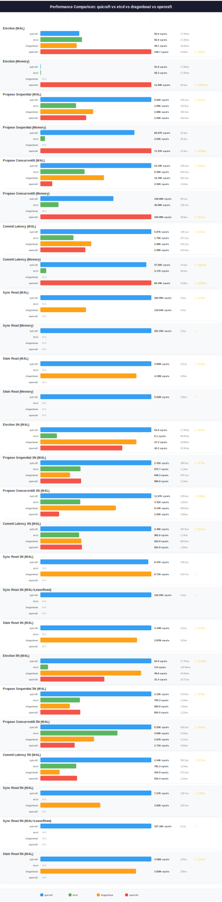

# Performance Benchmarks

Comparative benchmarks measuring QuicRaft against etcd, Dragonboat, OpenRaft
across four deployment configurations: single-node in-memory, single-node WAL, 3-node
cluster with mTLS, and 5-node cluster with mTLS.



## Quick Start

```bash
# Compare QuicRaft vs a specific system (builds Docker images, runs benchmarks, generates charts)
make perf-compare-etcd
make perf-compare-dragonboat
make perf-compare-openraft

# Compare all systems at once
make perf-compare-all

# Run a single system standalone
make perf-quicraft
make perf-etcd
make perf-dragonboat
make perf-openraft
```

## Test Environment

| Component | Specification |
|-----------|--------------|
| **Server** | Dell EMC PowerEdge R640 |
| **CPU** | 2x Intel Xeon Platinum 8260 @ 2.40GHz (24 cores / 48 threads each, 96 threads total) |
| **L3 Cache** | 71.5 MiB (35.75 MiB per socket) |
| **Memory** | 384 GiB DDR4 |
| **Storage** | NVMe SSD (6.4T, model 7335940:ICDPC2DD2ORA6.4T) |
| **NUMA** | 2 nodes, interleaved core assignment |
| **OS** | Ubuntu 24.04.4 LTS (Noble Numbat) |
| **Kernel** | 6.8.0-106-generic |
| **Docker** | 28.2.2 with buildx 0.21.3 |
| **Go** | 1.26.1 linux/amd64 |
| **Benchtime** | 30s per scenario |

All benchmarks run inside Docker containers with `--net=host` (QuicRaft also uses `--privileged` for UDP buffer tuning). Each system is benchmarked sequentially to avoid interference.

## Detailed Comparisons

| Comparison | Link |
|------------|------|
| QuicRaft vs etcd | [etcd.md](etcd.md) |
| QuicRaft vs Dragonboat | [dragonboat.md](dragonboat.md) |
| QuicRaft vs OpenRaft | [openraft.md](openraft.md) |

## System Overview

| System | Language | Type | WAL | Memory | Reads | Multi-Group | TLS |
|--------|----------|------|-----|--------|-------|-------------|-----|
| **QuicRaft** | Go | Engine | waldb (sharded) | memdb | SyncRead, StaleRead | Yes (10K+ shards) | QUIC mTLS (always on) |
| **etcd-io/raft** | Go | Library | User-provided | MemoryStorage | User-implemented | No | TCP mutual TLS |
| **Dragonboat** | Go | Engine | Tan (custom log-file DB) | N/A | SyncRead, StaleRead | Yes | TCP MutualTLS |
| **OpenRaft** | Rust | Library | Disk WAL (benchmark) | BTreeMap | User-implemented | No | TCP mutual TLS (tokio-rustls) |

## Benchmark Results

**BENCHTIME**: 30s

### Single-Node In-Memory (Framework Overhead)

Memory-mode benchmarks isolate framework overhead from I/O.

| Scenario | QuicRaft | etcd | Dragonboat | OpenRaft |
|----------|----------|------|------------|----------|
| Election (Memory) | 51.8 ops/s (P50 17.66ms, P95 26.60ms, P99 27.85ms) | 58.3 ops/s (P50 17.09ms, P95 21.95ms, P99 22.97ms) | N/A | 11.84K ops/s (P50 53.0us, P95 92.0us, P99 126.8us) |
| Propose Sequential (Memory) | 60.67K ops/s (P50 13.4us, P95 34.6us, P99 48.5us) | 3.03K ops/s (P50 45.3us, P95 1.14ms, P99 1.20ms) | N/A | 71.57K ops/s (P50 12.3us, P95 21.7us, P99 28.8us) |
| Propose Concurrent/8 (Memory) | 148.69K ops/s (P50 49.1us, P95 85.0us, P99 105.4us) | 36.99K ops/s (P50 106.7us, P95 1.01ms, P99 1.18ms) | N/A | 225.88K ops/s (P50 28.9us, P95 65.2us, P99 90.8us) |
| Commit Latency (Memory) | 57.65K ops/s (P50 14.5us, P95 33.8us, P99 45.9us) | 3.17K ops/s (P50 40.8us, P95 1.14ms, P99 1.20ms) | N/A | 60.44K ops/s (P50 14.8us, P95 26.2us, P99 34.7us) |
| Sync Read (Memory) | 281.03K ops/s (P50 2.6us, P95 7.6us, P99 11.4us) | N/A | N/A | N/A |
| Stale Read (Memory) | 5.02M ops/s (P50 129ns, P95 164ns, P99 367ns) | N/A | N/A | N/A |

### Single-Node WAL (Production-Realistic)

WAL-mode benchmarks include real persistence with fsync.

| Scenario | QuicRaft | etcd | Dragonboat | OpenRaft |
|----------|----------|------|------------|----------|
| Election (WAL) | 52.6 ops/s (P50 17.54ms, P95 23.58ms, P99 27.57ms) | 56.0 ops/s (P50 17.28ms, P95 22.29ms, P99 22.94ms) | 49.1 ops/s (P50 19.50ms, P95 26.34ms, P99 31.16ms) | 149.7 ops/s (P50 5.03ms, P95 6.11ms, P99 6.47ms) |
| Propose Sequential (WAL) | 5.62K ops/s (P50 155.1us, P95 301.4us, P99 586.1us) | 1.80K ops/s (P50 523.8us, P95 768.6us, P99 1.60ms) | 2.68K ops/s (P50 340.4us, P95 508.7us, P99 852.3us) | 2.32K ops/s (P50 419.3us, P95 613.0us, P99 755.6us) |
| Propose Concurrent/8 (WAL) | 23.44K ops/s (P50 295.5us, P95 644.6us, P99 762.9us) | 9.35K ops/s (P50 844.4us, P95 1.11ms, P99 1.27ms) | 13.44K ops/s (P50 581.5us, P95 810.0us, P99 932.6us) | 2.52K ops/s (P50 3.16ms, P95 4.02ms, P99 4.88ms) |
| Commit Latency (WAL) | 5.87K ops/s (P50 148.1us, P95 282.7us, P99 588.6us) | 1.75K ops/s (P50 537.2us, P95 753.5us, P99 1.62ms) | 2.69K ops/s (P50 342.1us, P95 503.4us, P99 762.6us) | 2.38K ops/s (P50 410.9us, P95 580.0us, P99 693.4us) |
| Sync Read (WAL) | 290.95K ops/s (P50 2.6us, P95 7.1us, P99 10.8us) | N/A | 119.64K ops/s (P50 6.4us, P95 18.3us, P99 29.3us) | N/A |
| Stale Read (WAL) | 4.80M ops/s (P50 131ns, P95 247ns, P99 400ns) | N/A | 4.15M ops/s (P50 163ns, P95 242ns, P99 443ns) | N/A |

### 3-Node Cluster with mTLS

All 3N benchmarks use TLS 1.3 with mutual authentication over localhost and disk WAL
with fsync for all systems.

| Scenario | QuicRaft | etcd | Dragonboat | OpenRaft |
|----------|----------|------|------------|----------|
| Election 3N (WAL) | 54.6 ops/s (P50 17.28ms, P95 23.04ms, P99 27.88ms) | 8.1 ops/s (P50 80.05ms, P95 105.60ms, P99 117.82ms) | 47.2 ops/s (P50 18.69ms, P95 29.77ms, P99 39.86ms) | 40.2 ops/s (P50 20.30ms, P95 21.86ms, P99 23.09ms) |
| Propose Sequential 3N (WAL) | 2.41K ops/s (P50 398.5us, P95 526.2us, P99 659.1us) | 873.7 ops/s (P50 1.12ms, P95 1.47ms, P99 1.67ms) | 646.3 ops/s (P50 978.1us, P95 1.38ms, P99 1.66ms) | 886.8 ops/s (P50 1.10ms, P95 1.46ms, P99 1.73ms) |
| Propose Concurrent/8 3N (WAL) | 11.97K ops/s (P50 429.6us, P95 800.1us, P99 1.12ms) | 4.31K ops/s (P50 1.82ms, P95 2.48ms, P99 2.90ms) | 8.14K ops/s (P50 950.8us, P95 1.26ms, P99 1.50ms) | 2.02K ops/s (P50 3.89ms, P95 5.13ms, P99 6.12ms) |
| Commit Latency 3N (WAL) | 2.48K ops/s (P50 387.9us, P95 521.7us, P99 660.0us) | 862.6 ops/s (P50 1.14ms, P95 1.49ms, P99 1.70ms) | 913.9 ops/s (P50 823.9us, P95 1.15ms, P99 1.45ms) | 924.9 ops/s (P50 1.06ms, P95 1.41ms, P99 1.66ms) |
| Sync Read 3N (WAL) | 8.47K ops/s (P50 109.2us, P95 170.6us, P99 215.3us) | N/A | 8.71K ops/s (P50 104.7us, P95 175.4us, P99 242.3us) | N/A |
| Sync Read 3N (WAL+LeaseRead) | 142.03K ops/s (P50 4.4us, P95 11.1us, P99 18.9us) | N/A | N/A | N/A |
| Stale Read 3N (WAL) | 4.44M ops/s (P50 142ns, P95 273ns, P99 451ns) | N/A | 3.87M ops/s (P50 163ns, P95 313ns, P99 567ns) | N/A |

### 5-Node Cluster with mTLS

5N benchmarks test larger quorum requirements (majority = 3/5) with disk WAL and fsync
for all systems.

| Scenario | QuicRaft | etcd | Dragonboat | OpenRaft |
|----------|----------|------|------------|----------|
| Election 5N (WAL) | 54.6 ops/s (P50 17.75ms, P95 23.16ms, P99 33.84ms) | 3.8 ops/s (P50 140.58ms, P95 177.81ms, P99 201.92ms) | 49.6 ops/s (P50 18.43ms, P95 24.57ms, P99 37.85ms) | 31.4 ops/s (P50 23.71ms, P95 25.47ms, P99 26.83ms) |
| Propose Sequential 5N (WAL) | 2.23K ops/s (P50 413.6us, P95 658.1us, P99 793.7us) | 794.3 ops/s (P50 1.24ms, P95 1.63ms, P99 1.86ms) | 593.8 ops/s (P50 1.06ms, P95 1.43ms, P99 1.68ms) | 804.5 ops/s (P50 1.22ms, P95 1.62ms, P99 1.88ms) |
| Propose Concurrent/8 5N (WAL) | 5.53K ops/s (P50 630.2us, P95 1.64ms, P99 2.56ms) | 3.84K ops/s (P50 2.03ms, P95 2.75ms, P99 3.26ms) | 2.67K ops/s (P50 1.11ms, P95 1.49ms, P99 1.75ms) | 1.71K ops/s (P50 4.56ms, P95 6.26ms, P99 7.57ms) |
| Commit Latency 5N (WAL) | 2.44K ops/s (P50 391.9us, P95 521.7us, P99 656.6us) | 791.3 ops/s (P50 1.24ms, P95 1.65ms, P99 1.89ms) | 424.9 ops/s (P50 972.2us, P95 1.38ms, P99 1.64ms) | 810.4 ops/s (P50 1.22ms, P95 1.59ms, P99 1.86ms) |
| Sync Read 5N (WAL) | 7.27K ops/s (P50 128.7us, P95 189.1us, P99 229.9us) | N/A | 3.92K ops/s (P50 150.4us, P95 238.4us, P99 351.6us) | N/A |
| Sync Read 5N (WAL+LeaseRead) | 107.16K ops/s (P50 6.1us, P95 13.9us, P99 26.5us) | N/A | N/A | N/A |
| Stale Read 5N (WAL) | 4.56M ops/s (P50 134ns, P95 307ns, P99 443ns) | N/A | 3.93M ops/s (P50 165ns, P95 308ns, P99 581ns) | N/A |

## Performance Summary

### vs Dragonboat Head-to-Head

QuicRaft wins **17** / 18 | Dragonboat wins **0** | Ties: **1**

### vs etcd Head-to-Head

QuicRaft wins **14** / 16 | etcd wins **2** | Ties: **0**

### vs OpenRaft Head-to-Head

QuicRaft wins **11** / 16 | OpenRaft wins **4** | Ties: **1**

### Pairwise Ratio Tables

See individual comparison documents for detailed analysis:

- [etcd.md](etcd.md) -- QuicRaft vs etcd
- [dragonboat.md](dragonboat.md) -- QuicRaft vs Dragonboat
- [openraft.md](openraft.md) -- QuicRaft vs OpenRaft

## Feature Availability

| Feature | QuicRaft | etcd | Dragonboat | OpenRaft |
|---------|----------|------|------------|----------|
| Memory-Only Mode | Yes (memdb) | Yes | No | Yes (1N only) |
| Multi-Node WAL | waldb (sharded, fsync) | File WAL (fsync) | Tan (fsync) | 16-shard WAL (bincode, fsync) |
| Built-in Transport | Yes (QUIC) | No (library) | Yes (TCP) | No (library) |
| Built-in Encryption | AES-GCM | No | No | No |
| Multi-Group | 10K+ shards | No | Yes | No |
| LeaseRead | Yes | No | No | No |

## Scenario Definitions

| Key | Mode | Description |
|-----|------|-------------|
| `election_wal` | WAL | Cold-start election time with persistent storage |
| `election_memory` | Memory | Cold-start election time with in-memory storage |
| `propose_seq_wal` | WAL | Sequential single-writer propose throughput |
| `propose_seq_memory` | Memory | Sequential single-writer propose throughput |
| `propose_conc8_wal` | WAL | 8-writer concurrent propose throughput |
| `propose_conc8_memory` | Memory | 8-writer concurrent propose throughput |
| `commit_latency_wal` | WAL | Per-proposal end-to-end commit latency |
| `commit_latency_memory` | Memory | Per-proposal end-to-end commit latency |
| `sync_read_wal` | WAL | Linearizable read via ReadIndex protocol |
| `sync_read_memory` | Memory | Linearizable read via ReadIndex protocol |
| `stale_read_wal` | WAL | Non-linearizable local state machine read |
| `stale_read_memory` | Memory | Non-linearizable local state machine read |
| `election_3n_wal` | 3N WAL | Cold-start election, 3-node cluster with TLS |
| `propose_seq_3n_wal` | 3N WAL | Sequential propose, 3-node cluster with TLS |
| `propose_conc8_3n_wal` | 3N WAL | 8-writer concurrent propose, 3-node cluster with TLS |
| `commit_latency_3n_wal` | 3N WAL | Per-proposal commit latency, 3-node cluster with TLS |
| `sync_read_3n_wal` | 3N WAL | Linearizable read, 3-node cluster with TLS |
| `stale_read_3n_wal` | 3N WAL | Local state machine read, 3-node cluster with TLS |
| `election_5n_wal` | 5N WAL | Cold-start election, 5-node cluster with TLS |
| `propose_seq_5n_wal` | 5N WAL | Sequential propose, 5-node cluster with TLS |
| `propose_conc8_5n_wal` | 5N WAL | 8-writer concurrent propose, 5-node cluster with TLS |
| `commit_latency_5n_wal` | 5N WAL | Per-proposal commit latency, 5-node cluster with TLS |
| `sync_read_5n_wal` | 5N WAL | Linearizable read, 5-node cluster with TLS |
| `stale_read_5n_wal` | 5N WAL | Local state machine read, 5-node cluster with TLS |
| `sync_read_3n_wal_leaseread` | 3N WAL | Linearizable read with LeaseRead, 3-node cluster (QuicRaft only) |
| `sync_read_5n_wal_leaseread` | 5N WAL | Linearizable read with LeaseRead, 5-node cluster (QuicRaft only) |

## Architecture

```
test/performance/
  README.md              <- This file (auto-generated by perfcompare generate)
  etcd.md                <- QuicRaft vs etcd-io/raft detailed analysis
  dragonboat.md          <- QuicRaft vs Dragonboat detailed analysis
  openraft.md            <- QuicRaft vs OpenRaft detailed analysis
  perfresult/            <- Shared types, comparison engine, chart generation
  cmd/perfcompare/       <- Go CLI orchestrator (Docker-based execution)
  quicraft/              <- QuicRaft benchmarks (standalone package)
  etcd/                  <- etcd-io/raft benchmarks (standalone package)
  dragonboat/            <- Dragonboat benchmarks (standalone package)
  openraft/              <- OpenRaft (Rust) benchmarks (standalone binary)
  charts/                <- Generated SVG charts (per-comparison subdirectories)
```
