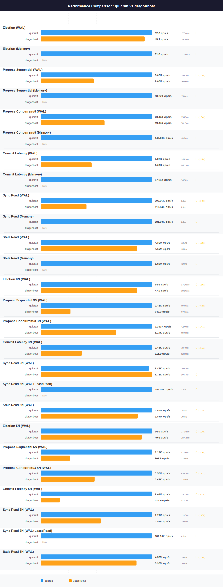

# QuicRaft vs Dragonboat Performance Comparison

**Date**: 2026-03-18 (fresh benchmark run, BENCHTIME=30s, isolated sequential Docker runs)
**BENCHTIME**: 30s

## Charts

> Regenerate: `make perf-compare-dragonboat`

## Head-to-Head Summary

**QuicRaft wins 17 out of 18 comparable head-to-head scenarios.** Dragonboat wins 0, with 1 virtual tie.

| Scenario | QuicRaft | Dragonboat | Winner | Ratio |
|----------|----------|------------|--------|-------|
| Election (WAL) | 52.6 ops/s (P50 17.54ms, P95 23.58ms, P99 27.57ms) | 49.1 ops/s (P50 19.50ms, P95 26.34ms, P99 31.16ms) | QuicRaft | 1.07x |
| Propose Sequential (WAL) | 5.62K ops/s (P50 155.1us, P95 301.4us, P99 586.1us) | 2.68K ops/s (P50 340.4us, P95 508.7us, P99 852.3us) | QuicRaft | 2.10x |
| Propose Concurrent/8 (WAL) | 23.44K ops/s (P50 295.5us, P95 644.6us, P99 762.9us) | 13.44K ops/s (P50 581.5us, P95 810.0us, P99 932.6us) | QuicRaft | 1.74x |
| Commit Latency (WAL) | 5.87K ops/s (P50 148.1us, P95 282.7us, P99 588.6us) | 2.69K ops/s (P50 342.1us, P95 503.4us, P99 762.6us) | QuicRaft | 2.18x |
| Sync Read (WAL) | 290.95K ops/s (P50 2.6us, P95 7.1us, P99 10.8us) | 119.64K ops/s (P50 6.4us, P95 18.3us, P99 29.3us) | QuicRaft | 2.43x |
| Stale Read (WAL) | 4.80M ops/s (P50 131ns, P95 247ns, P99 400ns) | 4.15M ops/s (P50 163ns, P95 242ns, P99 443ns) | QuicRaft | 1.16x |
| Election 3N (WAL) | 54.6 ops/s (P50 17.28ms, P95 23.04ms, P99 27.88ms) | 47.2 ops/s (P50 18.69ms, P95 29.77ms, P99 39.86ms) | QuicRaft | 1.15x |
| Propose Sequential 3N (WAL) | 2.41K ops/s (P50 398.5us, P95 526.2us, P99 659.1us) | 646.3 ops/s (P50 978.1us, P95 1.38ms, P99 1.66ms) | QuicRaft | 3.73x |
| Propose Concurrent/8 3N (WAL) | 11.97K ops/s (P50 429.6us, P95 800.1us, P99 1.12ms) | 8.14K ops/s (P50 950.8us, P95 1.26ms, P99 1.50ms) | QuicRaft | 1.47x |
| Commit Latency 3N (WAL) | 2.48K ops/s (P50 387.9us, P95 521.7us, P99 660.0us) | 913.9 ops/s (P50 823.9us, P95 1.15ms, P99 1.45ms) | QuicRaft | 2.71x |
| Sync Read 3N (WAL) | 8.47K ops/s (P50 109.2us, P95 170.6us, P99 215.3us) | 8.71K ops/s (P50 104.7us, P95 175.4us, P99 242.3us) | Tied | 1.03x |
| Stale Read 3N (WAL) | 4.44M ops/s (P50 142ns, P95 273ns, P99 451ns) | 3.87M ops/s (P50 163ns, P95 313ns, P99 567ns) | QuicRaft | 1.15x |
| Election 5N (WAL) | 54.6 ops/s (P50 17.75ms, P95 23.16ms, P99 33.84ms) | 49.6 ops/s (P50 18.43ms, P95 24.57ms, P99 37.85ms) | QuicRaft | 1.10x |
| Propose Sequential 5N (WAL) | 2.23K ops/s (P50 413.6us, P95 658.1us, P99 793.7us) | 593.8 ops/s (P50 1.06ms, P95 1.43ms, P99 1.68ms) | QuicRaft | 3.76x |
| Propose Concurrent/8 5N (WAL) | 5.53K ops/s (P50 630.2us, P95 1.64ms, P99 2.56ms) | 2.67K ops/s (P50 1.11ms, P95 1.49ms, P99 1.75ms) | QuicRaft | 2.07x |
| Commit Latency 5N (WAL) | 2.44K ops/s (P50 391.9us, P95 521.7us, P99 656.6us) | 424.9 ops/s (P50 972.2us, P95 1.38ms, P99 1.64ms) | QuicRaft | 5.75x |
| Sync Read 5N (WAL) | 7.27K ops/s (P50 128.7us, P95 189.1us, P99 229.9us) | 3.92K ops/s (P50 150.4us, P95 238.4us, P99 351.6us) | QuicRaft | 1.85x |
| Stale Read 5N (WAL) | 4.56M ops/s (P50 134ns, P95 307ns, P99 443ns) | 3.93M ops/s (P50 165ns, P95 308ns, P99 581ns) | QuicRaft | 1.16x |

8 additional scenarios exclusive to QuicRaft — see [Exclusive Scenarios](#exclusive-scenarios) below.

## Single-Node (1N) WAL Results

| Scenario | QuicRaft | Dragonboat | Winner | Ratio |
|----------|----------|------------|--------|-------|
| Election (WAL) | 52.6 ops/s, P50 17.54ms, P95 23.58ms, P99 27.57ms | 49.1 ops/s, P50 19.50ms, P95 26.34ms, P99 31.16ms | QuicRaft | 1.07x |
| Propose Sequential (WAL) | 5.62K ops/s, P50 155.1us, P95 301.4us, P99 586.1us | 2.68K ops/s, P50 340.4us, P95 508.7us, P99 852.3us | QuicRaft | 2.10x |
| Propose Concurrent/8 (WAL) | 23.44K ops/s, P50 295.5us, P95 644.6us, P99 762.9us | 13.44K ops/s, P50 581.5us, P95 810.0us, P99 932.6us | QuicRaft | 1.74x |
| Commit Latency (WAL) | 5.87K ops/s, P50 148.1us, P95 282.7us, P99 588.6us | 2.69K ops/s, P50 342.1us, P95 503.4us, P99 762.6us | QuicRaft | 2.18x |
| Sync Read (WAL) | 290.95K ops/s, P50 2.6us, P95 7.1us, P99 10.8us | 119.64K ops/s, P50 6.4us, P95 18.3us, P99 29.3us | QuicRaft | 2.43x |
| Stale Read (WAL) | 4.80M ops/s, P50 131ns, P95 247ns, P99 400ns | 4.15M ops/s, P50 163ns, P95 242ns, P99 443ns | QuicRaft | 1.16x |

## 3-Node Cluster (3N) Results

All 3N benchmarks use TLS 1.3 with mutual authentication over localhost.

| Scenario | QuicRaft | Dragonboat | Winner | Ratio |
|----------|----------|------------|--------|-------|
| Election 3N (WAL) | 54.6 ops/s, P50 17.28ms, P95 23.04ms, P99 27.88ms | 47.2 ops/s, P50 18.69ms, P95 29.77ms, P99 39.86ms | QuicRaft | 1.15x |
| Propose Sequential 3N (WAL) | 2.41K ops/s, P50 398.5us, P95 526.2us, P99 659.1us | 646.3 ops/s, P50 978.1us, P95 1.38ms, P99 1.66ms | QuicRaft | 3.73x |
| Propose Concurrent/8 3N (WAL) | 11.97K ops/s, P50 429.6us, P95 800.1us, P99 1.12ms | 8.14K ops/s, P50 950.8us, P95 1.26ms, P99 1.50ms | QuicRaft | 1.47x |
| Commit Latency 3N (WAL) | 2.48K ops/s, P50 387.9us, P95 521.7us, P99 660.0us | 913.9 ops/s, P50 823.9us, P95 1.15ms, P99 1.45ms | QuicRaft | 2.71x |
| Sync Read 3N (WAL) | 8.47K ops/s, P50 109.2us, P95 170.6us, P99 215.3us | 8.71K ops/s, P50 104.7us, P95 175.4us, P99 242.3us | Tied | 1.03x |
| Stale Read 3N (WAL) | 4.44M ops/s, P50 142ns, P95 273ns, P99 451ns | 3.87M ops/s, P50 163ns, P95 313ns, P99 567ns | QuicRaft | 1.15x |

## 5-Node Cluster (5N) Results

All 5N benchmarks use TLS 1.3 with mutual authentication over localhost, identical to 3N.

| Scenario | QuicRaft | Dragonboat | Winner | Ratio |
|----------|----------|------------|--------|-------|
| Election 5N (WAL) | 54.6 ops/s, P50 17.75ms, P95 23.16ms, P99 33.84ms | 49.6 ops/s, P50 18.43ms, P95 24.57ms, P99 37.85ms | QuicRaft | 1.10x |
| Propose Sequential 5N (WAL) | 2.23K ops/s, P50 413.6us, P95 658.1us, P99 793.7us | 593.8 ops/s, P50 1.06ms, P95 1.43ms, P99 1.68ms | QuicRaft | 3.76x |
| Propose Concurrent/8 5N (WAL) | 5.53K ops/s, P50 630.2us, P95 1.64ms, P99 2.56ms | 2.67K ops/s, P50 1.11ms, P95 1.49ms, P99 1.75ms | QuicRaft | 2.07x |
| Commit Latency 5N (WAL) | 2.44K ops/s, P50 391.9us, P95 521.7us, P99 656.6us | 424.9 ops/s, P50 972.2us, P95 1.38ms, P99 1.64ms | QuicRaft | 5.75x |
| Sync Read 5N (WAL) | 7.27K ops/s, P50 128.7us, P95 189.1us, P99 229.9us | 3.92K ops/s, P50 150.4us, P95 238.4us, P99 351.6us | QuicRaft | 1.85x |
| Stale Read 5N (WAL) | 4.56M ops/s, P50 134ns, P95 307ns, P99 443ns | 3.93M ops/s, P50 165ns, P95 308ns, P99 581ns | QuicRaft | 1.16x |

## Exclusive Scenarios

The following scenarios were only measured for QuicRaft (Dragonboat does not expose equivalent benchmarks):

| Scenario | Throughput | Latency |
|----------|-----------|---------|
| Election (Memory) | 51.8 ops/s | P50 17.66ms, P95 26.60ms, P99 27.85ms |
| Propose Sequential (Memory) | 60.67K ops/s | P50 13.4us, P95 34.6us, P99 48.5us |
| Propose Concurrent/8 (Memory) | 148.69K ops/s | P50 49.1us, P95 85.0us, P99 105.4us |
| Commit Latency (Memory) | 57.65K ops/s | P50 14.5us, P95 33.8us, P99 45.9us |
| Sync Read (Memory) | 281.03K ops/s | P50 2.6us, P95 7.6us, P99 11.4us |
| Stale Read (Memory) | 5.02M ops/s | P50 129ns, P95 164ns, P99 367ns |
| Sync Read 3N (WAL+LeaseRead) | 142.03K ops/s | P50 4.4us, P95 11.1us, P99 18.9us |
| Sync Read 5N (WAL+LeaseRead) | 107.16K ops/s | P50 6.1us, P95 13.9us, P99 26.5us |

## Test Configuration

### Single-Node (1N)

| Parameter | QuicRaft | Dragonboat |
|-----------|----------|------------|
| Benchtime | 30s | 30s |
| Payload | 128 bytes | 128 bytes |
| Concurrent Goroutines | 8 | 8 |
| TLS | Yes | Yes |
| Election RTT | 10 ticks | 10 ticks |
| Heartbeat RTT | 1 tick | 1 tick |
| RTT | 1ms | 1ms |

### Multi-Node (3N/5N)

| Parameter | QuicRaft | Dragonboat |
|-----------|----------|------------|
| Benchtime | 30s | 30s |
| TLS | TLS 1.3, mutual auth | TLS 1.3, mutual auth |
| Topology | In-process, localhost | In-process, localhost |
| Election RTT | 10 ticks | 10 ticks |
| Heartbeat RTT | 1 tick | 1 tick |
| RTT | 1ms | 1ms |
| Payload | 128 bytes | 128 bytes |
| Concurrent Goroutines | 8 | 8 |

## Analysis

### Architecture Comparison

| Aspect | QuicRaft | Dragonboat |
|--------|----------|------------|
| **Type** | Engine (batteries-included) | Engine (batteries-included) |
| **Transport** | QUIC with built-in mTLS | TCP with optional TLS |
| **WAL** | waldb (16-shard, parallel fsync) | Tan (custom log-file DB, Pebble-backed) |
| **State Machine** | Pluggable (in-memory and on-disk) | Pluggable (in-memory and on-disk) |
| **Multi-Group** | 10K+ shards per host | Yes (multi-group support) |
| **Read Path** | ReadIndex + LeaseRead | ReadIndex only |
| **Pipeline** | 3-stage (Step/Commit/Apply) | Single-threaded step loop per shard |

### Key Differences

**Transport**: QuicRaft uses QUIC with always-on mTLS. Dragonboat uses TCP with optional TLS that must be configured separately. QUIC provides 0-RTT connection establishment and multiplexed streams over a single UDP socket.

**WAL Architecture**: QuicRaft's waldb distributes entries across 16 shards with parallel fsync, which benefits concurrent write workloads. Dragonboat's Tan is a Pebble-backed log-file DB optimized for sequential throughput.

**Read Path**: QuicRaft supports both ReadIndex (quorum-confirmed) and LeaseRead (leader-lease-based, no network round-trip). Dragonboat supports ReadIndex only.
