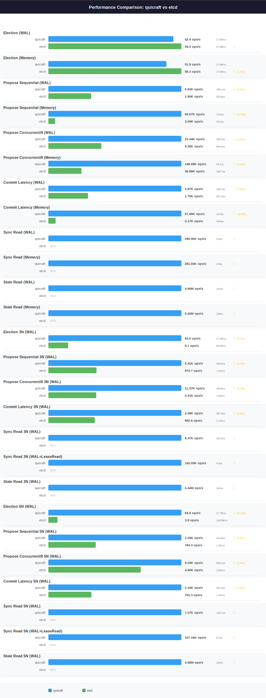

# QuicRaft vs etcd Performance Comparison

**Date**: 2026-03-18 (fresh benchmark run, BENCHTIME=30s, isolated sequential Docker runs)
**BENCHTIME**: 30s

## Charts

> Regenerate: `make perf-compare-etcd`

## Head-to-Head Summary

**QuicRaft wins 14 out of 16 comparable head-to-head scenarios.** etcd wins 2.

| Scenario | QuicRaft | etcd | Winner | Ratio |
|----------|----------|------|--------|-------|
| Election (WAL) | 52.6 ops/s (P50 17.54ms, P95 23.58ms, P99 27.57ms) | 56.0 ops/s (P50 17.28ms, P95 22.29ms, P99 22.94ms) | etcd | 1.06x |
| Election (Memory) | 51.8 ops/s (P50 17.66ms, P95 26.60ms, P99 27.85ms) | 58.3 ops/s (P50 17.09ms, P95 21.95ms, P99 22.97ms) | etcd | 1.13x |
| Propose Sequential (WAL) | 5.62K ops/s (P50 155.1us, P95 301.4us, P99 586.1us) | 1.80K ops/s (P50 523.8us, P95 768.6us, P99 1.60ms) | QuicRaft | 3.12x |
| Propose Sequential (Memory) | 60.67K ops/s (P50 13.4us, P95 34.6us, P99 48.5us) | 3.03K ops/s (P50 45.3us, P95 1.14ms, P99 1.20ms) | QuicRaft | 19.99x |
| Propose Concurrent/8 (WAL) | 23.44K ops/s (P50 295.5us, P95 644.6us, P99 762.9us) | 9.35K ops/s (P50 844.4us, P95 1.11ms, P99 1.27ms) | QuicRaft | 2.51x |
| Propose Concurrent/8 (Memory) | 148.69K ops/s (P50 49.1us, P95 85.0us, P99 105.4us) | 36.99K ops/s (P50 106.7us, P95 1.01ms, P99 1.18ms) | QuicRaft | 4.02x |
| Commit Latency (WAL) | 5.87K ops/s (P50 148.1us, P95 282.7us, P99 588.6us) | 1.75K ops/s (P50 537.2us, P95 753.5us, P99 1.62ms) | QuicRaft | 3.35x |
| Commit Latency (Memory) | 57.65K ops/s (P50 14.5us, P95 33.8us, P99 45.9us) | 3.17K ops/s (P50 40.8us, P95 1.14ms, P99 1.20ms) | QuicRaft | 18.20x |
| Election 3N (WAL) | 54.6 ops/s (P50 17.28ms, P95 23.04ms, P99 27.88ms) | 8.1 ops/s (P50 80.05ms, P95 105.60ms, P99 117.82ms) | QuicRaft | 6.73x |
| Propose Sequential 3N (WAL) | 2.41K ops/s (P50 398.5us, P95 526.2us, P99 659.1us) | 873.7 ops/s (P50 1.12ms, P95 1.47ms, P99 1.67ms) | QuicRaft | 2.76x |
| Propose Concurrent/8 3N (WAL) | 11.97K ops/s (P50 429.6us, P95 800.1us, P99 1.12ms) | 4.31K ops/s (P50 1.82ms, P95 2.48ms, P99 2.90ms) | QuicRaft | 2.78x |
| Commit Latency 3N (WAL) | 2.48K ops/s (P50 387.9us, P95 521.7us, P99 660.0us) | 862.6 ops/s (P50 1.14ms, P95 1.49ms, P99 1.70ms) | QuicRaft | 2.87x |
| Election 5N (WAL) | 54.6 ops/s (P50 17.75ms, P95 23.16ms, P99 33.84ms) | 3.8 ops/s (P50 140.58ms, P95 177.81ms, P99 201.92ms) | QuicRaft | 14.39x |
| Propose Sequential 5N (WAL) | 2.23K ops/s (P50 413.6us, P95 658.1us, P99 793.7us) | 794.3 ops/s (P50 1.24ms, P95 1.63ms, P99 1.86ms) | QuicRaft | 2.81x |
| Propose Concurrent/8 5N (WAL) | 5.53K ops/s (P50 630.2us, P95 1.64ms, P99 2.56ms) | 3.84K ops/s (P50 2.03ms, P95 2.75ms, P99 3.26ms) | QuicRaft | 1.44x |
| Commit Latency 5N (WAL) | 2.44K ops/s (P50 391.9us, P95 521.7us, P99 656.6us) | 791.3 ops/s (P50 1.24ms, P95 1.65ms, P99 1.89ms) | QuicRaft | 3.09x |

10 additional scenarios exclusive to QuicRaft — see [Exclusive Scenarios](#exclusive-scenarios) below.

## Single-Node (1N) WAL Results

| Scenario | QuicRaft | etcd | Winner | Ratio |
|----------|----------|------|--------|-------|
| Election (WAL) | 52.6 ops/s, P50 17.54ms, P95 23.58ms, P99 27.57ms | 56.0 ops/s, P50 17.28ms, P95 22.29ms, P99 22.94ms | etcd | 1.06x |
| Propose Sequential (WAL) | 5.62K ops/s, P50 155.1us, P95 301.4us, P99 586.1us | 1.80K ops/s, P50 523.8us, P95 768.6us, P99 1.60ms | QuicRaft | 3.12x |
| Propose Concurrent/8 (WAL) | 23.44K ops/s, P50 295.5us, P95 644.6us, P99 762.9us | 9.35K ops/s, P50 844.4us, P95 1.11ms, P99 1.27ms | QuicRaft | 2.51x |
| Commit Latency (WAL) | 5.87K ops/s, P50 148.1us, P95 282.7us, P99 588.6us | 1.75K ops/s, P50 537.2us, P95 753.5us, P99 1.62ms | QuicRaft | 3.35x |

## Single-Node (1N) Memory Results

| Scenario | QuicRaft | etcd | Winner | Ratio |
|----------|----------|------|--------|-------|
| Election (Memory) | 51.8 ops/s, P50 17.66ms, P95 26.60ms, P99 27.85ms | 58.3 ops/s, P50 17.09ms, P95 21.95ms, P99 22.97ms | etcd | 1.13x |
| Propose Sequential (Memory) | 60.67K ops/s, P50 13.4us, P95 34.6us, P99 48.5us | 3.03K ops/s, P50 45.3us, P95 1.14ms, P99 1.20ms | QuicRaft | 19.99x |
| Propose Concurrent/8 (Memory) | 148.69K ops/s, P50 49.1us, P95 85.0us, P99 105.4us | 36.99K ops/s, P50 106.7us, P95 1.01ms, P99 1.18ms | QuicRaft | 4.02x |
| Commit Latency (Memory) | 57.65K ops/s, P50 14.5us, P95 33.8us, P99 45.9us | 3.17K ops/s, P50 40.8us, P95 1.14ms, P99 1.20ms | QuicRaft | 18.20x |

## 3-Node Cluster (3N) Results

All 3N benchmarks use TLS 1.3 with mutual authentication over localhost.

| Scenario | QuicRaft | etcd | Winner | Ratio |
|----------|----------|------|--------|-------|
| Election 3N (WAL) | 54.6 ops/s, P50 17.28ms, P95 23.04ms, P99 27.88ms | 8.1 ops/s, P50 80.05ms, P95 105.60ms, P99 117.82ms | QuicRaft | 6.73x |
| Propose Sequential 3N (WAL) | 2.41K ops/s, P50 398.5us, P95 526.2us, P99 659.1us | 873.7 ops/s, P50 1.12ms, P95 1.47ms, P99 1.67ms | QuicRaft | 2.76x |
| Propose Concurrent/8 3N (WAL) | 11.97K ops/s, P50 429.6us, P95 800.1us, P99 1.12ms | 4.31K ops/s, P50 1.82ms, P95 2.48ms, P99 2.90ms | QuicRaft | 2.78x |
| Commit Latency 3N (WAL) | 2.48K ops/s, P50 387.9us, P95 521.7us, P99 660.0us | 862.6 ops/s, P50 1.14ms, P95 1.49ms, P99 1.70ms | QuicRaft | 2.87x |

## 5-Node Cluster (5N) Results

All 5N benchmarks use TLS 1.3 with mutual authentication over localhost, identical to 3N.

| Scenario | QuicRaft | etcd | Winner | Ratio |
|----------|----------|------|--------|-------|
| Election 5N (WAL) | 54.6 ops/s, P50 17.75ms, P95 23.16ms, P99 33.84ms | 3.8 ops/s, P50 140.58ms, P95 177.81ms, P99 201.92ms | QuicRaft | 14.39x |
| Propose Sequential 5N (WAL) | 2.23K ops/s, P50 413.6us, P95 658.1us, P99 793.7us | 794.3 ops/s, P50 1.24ms, P95 1.63ms, P99 1.86ms | QuicRaft | 2.81x |
| Propose Concurrent/8 5N (WAL) | 5.53K ops/s, P50 630.2us, P95 1.64ms, P99 2.56ms | 3.84K ops/s, P50 2.03ms, P95 2.75ms, P99 3.26ms | QuicRaft | 1.44x |
| Commit Latency 5N (WAL) | 2.44K ops/s, P50 391.9us, P95 521.7us, P99 656.6us | 791.3 ops/s, P50 1.24ms, P95 1.65ms, P99 1.89ms | QuicRaft | 3.09x |

## Exclusive Scenarios

The following scenarios were only measured for QuicRaft (etcd does not expose equivalent benchmarks):

| Scenario | Throughput | Latency |
|----------|-----------|---------|
| Sync Read (WAL) | 290.95K ops/s | P50 2.6us, P95 7.1us, P99 10.8us |
| Sync Read (Memory) | 281.03K ops/s | P50 2.6us, P95 7.6us, P99 11.4us |
| Stale Read (WAL) | 4.80M ops/s | P50 131ns, P95 247ns, P99 400ns |
| Stale Read (Memory) | 5.02M ops/s | P50 129ns, P95 164ns, P99 367ns |
| Sync Read 3N (WAL) | 8.47K ops/s | P50 109.2us, P95 170.6us, P99 215.3us |
| Sync Read 3N (WAL+LeaseRead) | 142.03K ops/s | P50 4.4us, P95 11.1us, P99 18.9us |
| Stale Read 3N (WAL) | 4.44M ops/s | P50 142ns, P95 273ns, P99 451ns |
| Sync Read 5N (WAL) | 7.27K ops/s | P50 128.7us, P95 189.1us, P99 229.9us |
| Sync Read 5N (WAL+LeaseRead) | 107.16K ops/s | P50 6.1us, P95 13.9us, P99 26.5us |
| Stale Read 5N (WAL) | 4.56M ops/s | P50 134ns, P95 307ns, P99 443ns |

## Test Configuration

### Single-Node (1N)

| Parameter | QuicRaft | etcd |
|-----------|----------|------|
| Benchtime | 30s | 30s |
| Payload | 128 bytes | 128 bytes |
| Concurrent Goroutines | 8 | 8 |
| TLS | Yes | No |
| Election RTT | 10 ticks | 10 ticks |
| Heartbeat RTT | 1 tick | 1 tick |
| RTT | 1ms | 1ms |

### Multi-Node (3N/5N)

| Parameter | QuicRaft | etcd |
|-----------|----------|------|
| Benchtime | 30s | 30s |
| TLS | TLS 1.3, mutual auth | TLS 1.3, mutual auth |
| Topology | In-process, localhost | In-process, localhost |
| Election RTT | 10 ticks | 10 ticks |
| Heartbeat RTT | 1 tick | 1 tick |
| RTT | 1ms | 1ms |
| Payload | 128 bytes | 128 bytes |
| Concurrent Goroutines | 8 | 8 |

## Analysis

### Architecture Comparison

| Aspect | QuicRaft | etcd-io/raft |
|--------|----------|--------------|
| **Type** | Engine (batteries-included) | Library (bring your own transport/storage) |
| **Transport** | QUIC with built-in mTLS | User-provided (benchmark uses TCP+TLS) |
| **WAL** | waldb (16-shard, parallel fsync) | User-provided (benchmark uses bbolt) |
| **State Machine** | Pluggable (in-memory and on-disk) | User-implemented |
| **Multi-Group** | 10K+ shards per host | No (single group per instance) |
| **Read Path** | ReadIndex + LeaseRead | User-implemented ReadIndex |
| **Pipeline** | 3-stage (Step/Commit/Apply) | User-controlled event loop |

### Key Differences

**Engine vs Library**: QuicRaft is a complete engine with integrated transport, storage, and read protocols. etcd-io/raft is a library that requires the user to implement transport, storage, and the ReadIndex protocol. This means etcd performance is highly dependent on the integrator's implementation choices.

**Multi-Group**: QuicRaft supports 10K+ shards per host natively. etcd-io/raft is single-group per instance — multi-group requires running multiple raft instances.

**Read Path**: QuicRaft provides built-in SyncRead (ReadIndex), LeaseRead, and StaleRead. etcd-io/raft exposes ReadIndex messages but the user must implement the full read protocol.
