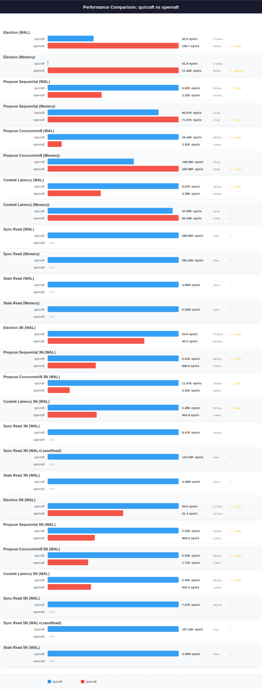

# QuicRaft vs OpenRaft Performance Comparison

**Date**: 2026-03-18 (fresh benchmark run, BENCHTIME=30s, isolated sequential Docker runs)
**BENCHTIME**: 30s

## Charts

> Regenerate: `make perf-compare-openraft`

## Head-to-Head Summary

**QuicRaft wins 11 out of 16 comparable head-to-head scenarios.** OpenRaft wins 4, with 1 virtual tie.

| Scenario | QuicRaft | OpenRaft | Winner | Ratio |
|----------|----------|----------|--------|-------|
| Election (WAL) | 52.6 ops/s (P50 17.54ms, P95 23.58ms, P99 27.57ms) | 149.7 ops/s (P50 5.03ms, P95 6.11ms, P99 6.47ms) | OpenRaft | 2.85x |
| Election (Memory) | 51.8 ops/s (P50 17.66ms, P95 26.60ms, P99 27.85ms) | 11.84K ops/s (P50 53.0us, P95 92.0us, P99 126.8us) | OpenRaft | 228.69x |
| Propose Sequential (WAL) | 5.62K ops/s (P50 155.1us, P95 301.4us, P99 586.1us) | 2.32K ops/s (P50 419.3us, P95 613.0us, P99 755.6us) | QuicRaft | 2.42x |
| Propose Sequential (Memory) | 60.67K ops/s (P50 13.4us, P95 34.6us, P99 48.5us) | 71.57K ops/s (P50 12.3us, P95 21.7us, P99 28.8us) | OpenRaft | 1.18x |
| Propose Concurrent/8 (WAL) | 23.44K ops/s (P50 295.5us, P95 644.6us, P99 762.9us) | 2.52K ops/s (P50 3.16ms, P95 4.02ms, P99 4.88ms) | QuicRaft | 9.29x |
| Propose Concurrent/8 (Memory) | 148.69K ops/s (P50 49.1us, P95 85.0us, P99 105.4us) | 225.88K ops/s (P50 28.9us, P95 65.2us, P99 90.8us) | OpenRaft | 1.52x |
| Commit Latency (WAL) | 5.87K ops/s (P50 148.1us, P95 282.7us, P99 588.6us) | 2.38K ops/s (P50 410.9us, P95 580.0us, P99 693.4us) | QuicRaft | 2.46x |
| Commit Latency (Memory) | 57.65K ops/s (P50 14.5us, P95 33.8us, P99 45.9us) | 60.44K ops/s (P50 14.8us, P95 26.2us, P99 34.7us) | Tied | 1.05x |
| Election 3N (WAL) | 54.6 ops/s (P50 17.28ms, P95 23.04ms, P99 27.88ms) | 40.2 ops/s (P50 20.30ms, P95 21.86ms, P99 23.09ms) | QuicRaft | 1.36x |
| Propose Sequential 3N (WAL) | 2.41K ops/s (P50 398.5us, P95 526.2us, P99 659.1us) | 886.8 ops/s (P50 1.10ms, P95 1.46ms, P99 1.73ms) | QuicRaft | 2.72x |
| Propose Concurrent/8 3N (WAL) | 11.97K ops/s (P50 429.6us, P95 800.1us, P99 1.12ms) | 2.02K ops/s (P50 3.89ms, P95 5.13ms, P99 6.12ms) | QuicRaft | 5.93x |
| Commit Latency 3N (WAL) | 2.48K ops/s (P50 387.9us, P95 521.7us, P99 660.0us) | 924.9 ops/s (P50 1.06ms, P95 1.41ms, P99 1.66ms) | QuicRaft | 2.68x |
| Election 5N (WAL) | 54.6 ops/s (P50 17.75ms, P95 23.16ms, P99 33.84ms) | 31.4 ops/s (P50 23.71ms, P95 25.47ms, P99 26.83ms) | QuicRaft | 1.74x |
| Propose Sequential 5N (WAL) | 2.23K ops/s (P50 413.6us, P95 658.1us, P99 793.7us) | 804.5 ops/s (P50 1.22ms, P95 1.62ms, P99 1.88ms) | QuicRaft | 2.78x |
| Propose Concurrent/8 5N (WAL) | 5.53K ops/s (P50 630.2us, P95 1.64ms, P99 2.56ms) | 1.71K ops/s (P50 4.56ms, P95 6.26ms, P99 7.57ms) | QuicRaft | 3.23x |
| Commit Latency 5N (WAL) | 2.44K ops/s (P50 391.9us, P95 521.7us, P99 656.6us) | 810.4 ops/s (P50 1.22ms, P95 1.59ms, P99 1.86ms) | QuicRaft | 3.02x |

10 additional scenarios exclusive to QuicRaft — see [Exclusive Scenarios](#exclusive-scenarios) below.

## Single-Node (1N) WAL Results

| Scenario | QuicRaft | OpenRaft | Winner | Ratio |
|----------|----------|----------|--------|-------|
| Election (WAL) | 52.6 ops/s, P50 17.54ms, P95 23.58ms, P99 27.57ms | 149.7 ops/s, P50 5.03ms, P95 6.11ms, P99 6.47ms | OpenRaft | 2.85x |
| Propose Sequential (WAL) | 5.62K ops/s, P50 155.1us, P95 301.4us, P99 586.1us | 2.32K ops/s, P50 419.3us, P95 613.0us, P99 755.6us | QuicRaft | 2.42x |
| Propose Concurrent/8 (WAL) | 23.44K ops/s, P50 295.5us, P95 644.6us, P99 762.9us | 2.52K ops/s, P50 3.16ms, P95 4.02ms, P99 4.88ms | QuicRaft | 9.29x |
| Commit Latency (WAL) | 5.87K ops/s, P50 148.1us, P95 282.7us, P99 588.6us | 2.38K ops/s, P50 410.9us, P95 580.0us, P99 693.4us | QuicRaft | 2.46x |

## Single-Node (1N) Memory Results

| Scenario | QuicRaft | OpenRaft | Winner | Ratio |
|----------|----------|----------|--------|-------|
| Election (Memory) | 51.8 ops/s, P50 17.66ms, P95 26.60ms, P99 27.85ms | 11.84K ops/s, P50 53.0us, P95 92.0us, P99 126.8us | OpenRaft | 228.69x |
| Propose Sequential (Memory) | 60.67K ops/s, P50 13.4us, P95 34.6us, P99 48.5us | 71.57K ops/s, P50 12.3us, P95 21.7us, P99 28.8us | OpenRaft | 1.18x |
| Propose Concurrent/8 (Memory) | 148.69K ops/s, P50 49.1us, P95 85.0us, P99 105.4us | 225.88K ops/s, P50 28.9us, P95 65.2us, P99 90.8us | OpenRaft | 1.52x |
| Commit Latency (Memory) | 57.65K ops/s, P50 14.5us, P95 33.8us, P99 45.9us | 60.44K ops/s, P50 14.8us, P95 26.2us, P99 34.7us | Tied | 1.05x |

## 3-Node Cluster (3N) Results

All 3N benchmarks use TLS 1.3 with mutual authentication over localhost.

| Scenario | QuicRaft | OpenRaft | Winner | Ratio |
|----------|----------|----------|--------|-------|
| Election 3N (WAL) | 54.6 ops/s, P50 17.28ms, P95 23.04ms, P99 27.88ms | 40.2 ops/s, P50 20.30ms, P95 21.86ms, P99 23.09ms | QuicRaft | 1.36x |
| Propose Sequential 3N (WAL) | 2.41K ops/s, P50 398.5us, P95 526.2us, P99 659.1us | 886.8 ops/s, P50 1.10ms, P95 1.46ms, P99 1.73ms | QuicRaft | 2.72x |
| Propose Concurrent/8 3N (WAL) | 11.97K ops/s, P50 429.6us, P95 800.1us, P99 1.12ms | 2.02K ops/s, P50 3.89ms, P95 5.13ms, P99 6.12ms | QuicRaft | 5.93x |
| Commit Latency 3N (WAL) | 2.48K ops/s, P50 387.9us, P95 521.7us, P99 660.0us | 924.9 ops/s, P50 1.06ms, P95 1.41ms, P99 1.66ms | QuicRaft | 2.68x |

## 5-Node Cluster (5N) Results

All 5N benchmarks use TLS 1.3 with mutual authentication over localhost, identical to 3N.

| Scenario | QuicRaft | OpenRaft | Winner | Ratio |
|----------|----------|----------|--------|-------|
| Election 5N (WAL) | 54.6 ops/s, P50 17.75ms, P95 23.16ms, P99 33.84ms | 31.4 ops/s, P50 23.71ms, P95 25.47ms, P99 26.83ms | QuicRaft | 1.74x |
| Propose Sequential 5N (WAL) | 2.23K ops/s, P50 413.6us, P95 658.1us, P99 793.7us | 804.5 ops/s, P50 1.22ms, P95 1.62ms, P99 1.88ms | QuicRaft | 2.78x |
| Propose Concurrent/8 5N (WAL) | 5.53K ops/s, P50 630.2us, P95 1.64ms, P99 2.56ms | 1.71K ops/s, P50 4.56ms, P95 6.26ms, P99 7.57ms | QuicRaft | 3.23x |
| Commit Latency 5N (WAL) | 2.44K ops/s, P50 391.9us, P95 521.7us, P99 656.6us | 810.4 ops/s, P50 1.22ms, P95 1.59ms, P99 1.86ms | QuicRaft | 3.02x |

## Exclusive Scenarios

The following scenarios were only measured for QuicRaft (OpenRaft does not expose equivalent benchmarks):

| Scenario | Throughput | Latency |
|----------|-----------|---------|
| Sync Read (WAL) | 290.95K ops/s | P50 2.6us, P95 7.1us, P99 10.8us |
| Sync Read (Memory) | 281.03K ops/s | P50 2.6us, P95 7.6us, P99 11.4us |
| Stale Read (WAL) | 4.80M ops/s | P50 131ns, P95 247ns, P99 400ns |
| Stale Read (Memory) | 5.02M ops/s | P50 129ns, P95 164ns, P99 367ns |
| Sync Read 3N (WAL) | 8.47K ops/s | P50 109.2us, P95 170.6us, P99 215.3us |
| Sync Read 3N (WAL+LeaseRead) | 142.03K ops/s | P50 4.4us, P95 11.1us, P99 18.9us |
| Stale Read 3N (WAL) | 4.44M ops/s | P50 142ns, P95 273ns, P99 451ns |
| Sync Read 5N (WAL) | 7.27K ops/s | P50 128.7us, P95 189.1us, P99 229.9us |
| Sync Read 5N (WAL+LeaseRead) | 107.16K ops/s | P50 6.1us, P95 13.9us, P99 26.5us |
| Stale Read 5N (WAL) | 4.56M ops/s | P50 134ns, P95 307ns, P99 443ns |

## Test Configuration

### Single-Node (1N)

| Parameter | QuicRaft | OpenRaft |
|-----------|----------|----------|
| Benchtime | 30s | 30s |
| Payload | 128 bytes | 128 bytes |
| Concurrent Goroutines | 8 | 8 |
| TLS | Yes | Yes |
| Election RTT | 10 ticks | 10 ticks |
| Heartbeat RTT | 1 tick | 1 tick |
| RTT | 1ms | 1ms |

### Multi-Node (3N/5N)

| Parameter | QuicRaft | OpenRaft |
|-----------|----------|----------|
| Benchtime | 30s | 30s |
| TLS | TLS 1.3, mutual auth | TLS 1.3, mutual auth |
| Topology | In-process, localhost | In-process, localhost |
| Election RTT | 10 ticks | 10 ticks |
| Heartbeat RTT | 1 tick | 1 tick |
| RTT | 1ms | 1ms |
| Payload | 128 bytes | 128 bytes |
| Concurrent Goroutines | 8 | 8 |

## Analysis

### Architecture Comparison

| Aspect | QuicRaft | OpenRaft |
|--------|----------|----------|
| **Language** | Go | Rust |
| **Type** | Engine (batteries-included) | Library (bring your own transport/storage) |
| **Transport** | QUIC with built-in mTLS | User-provided (benchmark uses persistent TCP+TLS with bincode) |
| **WAL** | waldb (16-shard, parallel fsync) | 16-shard WAL (bincode, parallel fsync) |
| **State Machine** | Pluggable (in-memory and on-disk) | Async trait-based |
| **Concurrency** | Goroutines + channels | Tokio async runtime |

### Key Differences

**Engine vs Library**: QuicRaft is a complete engine. OpenRaft is a library that requires implementing transport, storage, and read protocols. The benchmark provides a 16-shard WAL and persistent TCP+TLS transport with bincode serialization for architectural parity.

**Transport**: QuicRaft uses QUIC with native stream multiplexing and 0-RTT resumption. OpenRaft's benchmark uses persistent TCP+TLS connections with bincode serialization (one connection per peer, reused across RPCs). QUIC's multiplexing gives QuicRaft an advantage under concurrent load.

**Language Runtime**: Go's garbage collector introduces occasional pause jitter. Rust has deterministic memory management with no GC. This primarily affects tail latency (P99+) rather than median throughput.

**Concurrent Writes**: Both QuicRaft and the OpenRaft benchmark use a 16-shard WAL with parallel fsync, providing architectural parity for concurrent write workload comparisons.
